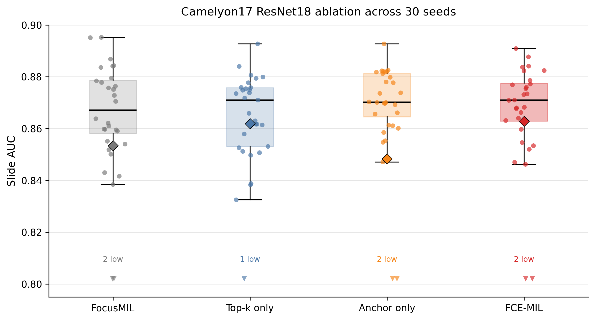
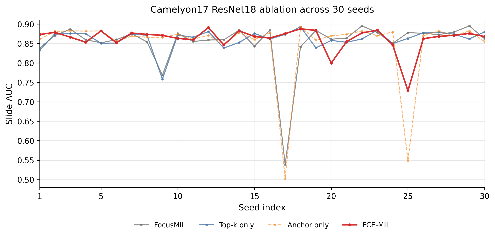

# FCE-MIL

Implementation for **Feature-Consistent Evidence Expansion for Weakly Supervised Whole Slide Image Classification**.

FCE-MIL is a training-time evidence expansion strategy for regularized max-pooling MIL. It improves the instance scorer by expanding supervision from high-confidence evidence patches to feature-consistent candidate patches, while keeping the inference-time slide prediction max-pooling-based.

## Repository Contents

```text
fce_code/
  fce_camelyon16.py       # FCE-MIL training on Camelyon16 feature bags
  fce_camelyon17.py       # FCE-MIL training on Camelyon17 feature bags
  camelyon17_utils.py     # Camelyon17 split, dataloader, and evaluation helpers
requirements.txt
README.md
```

The repository contains the FCE-MIL training code used for the paper experiments. It does not redistribute raw WSIs, official annotations, pretrained feature files, checkpoints, generated heatmaps, or external FROC evaluation files.

## Environment

Create a Python environment and install dependencies:

```bash
conda create -n fce python=3.9
conda activate fce
pip install -r requirements.txt
```

Install PyTorch according to your CUDA version if the default pip wheel is not suitable:

```bash
# Example only. Choose the command matching your CUDA version from pytorch.org.
pip install torch torchvision --index-url https://download.pytorch.org/whl/cu121
```

If you use the external FocusMIL/Camelyon16 FROC evaluation kit with official Camelyon masks, OpenSlide may also require the system library:

```bash
sudo apt-get install openslide-tools
```

## Data Sources and Format

The training scripts assume pre-extracted patch features. Raw WSIs and official annotations are not redistributed. In the paper experiments, Camelyon16 ResNet18 and CTransPath feature bags follow the feature package/preprocessing used by FocusMIL, while Camelyon17 ResNet18 feature bags follow the feature package/split released with AEM. Users should download the original Camelyon data and obtain or extract compatible feature bags before running the scripts.

### Camelyon16 Feature Directory

The Camelyon16 scripts expect a directory containing files such as:

```text
train_patch_feat.h5
train_patch_label.npy
train_patch_corresponding_slide_label.npy
train_patch_corresponding_slide_index.npy
train_patch_corresponding_slide_name.npy

val_patch_feat.h5
val_patch_label.npy
val_patch_corresponding_slide_label.npy
val_patch_corresponding_slide_index.npy
val_patch_corresponding_slide_name.npy
```

The HDF5 feature file should contain `dataset_1` with shape `[N_patches, D]`. The NumPy arrays are row-aligned with this feature matrix:

```text
*_patch_label.npy                       # patch-level labels, used only for evaluation/analysis
*_patch_corresponding_slide_label.npy   # slide-level label for each patch row
*_patch_corresponding_slide_index.npy   # integer slide index for each patch row
*_patch_corresponding_slide_name.npy    # slide name for each patch row
```

During training, rows with the same slide index are grouped as one MIL bag.

### Camelyon17 Feature File

The Camelyon17 scripts expect an HDF5 feature file and a metadata CSV:

```text
patch_feats_pretrain_natural_supervised.h5
camelyon17.csv
```

The HDF5 file is organized by slide ID. Each slide group should contain:

```text
/<slide_id>/feat      # [N_patches, D] patch features
/<slide_id>/coords    # [N_patches, 2] level-0 patch coordinates
attrs['label']        # original Camelyon17 label
```

The metadata CSV should include `slide_id` and `center` columns. Following the common OOD split, slides with zero-indexed `center >= 3` are used as the test set, while the remaining slides are split into training and validation sets.

## Training Examples

All paths below are placeholders and should be replaced with local paths.

### Camelyon16 FCE-MIL

```bash
python fce_code/fce_camelyon16.py \
  --dataset_dir /path/to/camelyon16_features \
  --seeds 1,2,3,4,5 \
  --train_pooling adaptive_topk \
  --eval_pooling max \
  --topk_max 16 \
  --topk_gamma 1.0 \
  --anchor_coef 0.05 \
  --anchor_sim_threshold 0.75 \
  --anchor_expand_topk 64 \
  --anchor_min_score 0.9 \
  --batch_size 3 \
  --epochs 100 \
  --checkpoint_dir checkpoints/c16_fce
```

### Camelyon17 FCE-MIL

```bash
python fce_code/fce_camelyon17.py \
  --file_path /path/to/camelyon17_features.h5 \
  --csv_path /path/to/camelyon17.csv \
  --seeds 2021,2022,2023,2024,2025 \
  --train_pooling adaptive_topk \
  --eval_pooling max \
  --topk_max 16 \
  --topk_gamma 1.0 \
  --anchor_coef 0.05 \
  --anchor_sim_threshold 0.75 \
  --anchor_expand_topk 64 \
  --anchor_min_score 0.9 \
  --batch_size 3 \
  --epochs 100 \
  --checkpoint_dir checkpoints/c17_fce
```

## FROC Evaluation

For Camelyon16 localization, FROC was computed using the FocusMIL-provided Camelyon16 FROC evaluation files together with the official Camelyon16 tumor masks. These external evaluation files are not redistributed in this repository. To reproduce the paper numbers, train FCE-MIL with the scripts above and run the external FocusMIL FROC kit under the same protocol.

Default FROC settings used by the paper:

```text
Evaluation level: 5
Level-0 resolution: 0.243 um/pixel
Detection point: patch center
Tolerance: 90 um
ITC threshold: 200 um
FROC points: 0.25, 0.5, 1, 2, 4, 8 FP/slide
```

## Main FCE-MIL Hyperparameters

```text
K_max / topk_max: 16
topk_gamma: 1.0
anchor_min_score: 0.9
anchor_sim_threshold: 0.75
anchor_expand_topk / M_max: 64
anchor_coef: 0.05
```

## Additional Camelyon17 Ablation

The following additional ablation was run on Camelyon17 with ResNet18 feature bags over **30 random seeds (1-30)**. Slide Avg. denotes the mean over slide-level AUC, ACC, and F1. This setting uses the same max-pooling inference rule for all variants.

| Variant | Adaptive top-k | Anchor expansion | Slide AUC | Slide ACC | Slide F1 | Slide Avg. |
|---|---:|---:|---:|---:|---:|---:|
| FocusMIL | No | No | 0.8534 (0.8305, 0.8763) | 0.8507 (0.8240, 0.8773) | 0.7967 (0.7782, 0.8151) | 0.8336 |
| Top-k only | Yes | No | <u>0.8619 (0.8532, 0.8707)</u> | <u>0.8670 (0.8592, 0.8748)</u> | <u>0.8090 (0.7988, 0.8191)</u> | <u>0.8460</u> |
| Anchor only | No | Yes | 0.8483 (0.8166, 0.8800) | 0.8538 (0.8206, 0.8870) | 0.8051 (0.7795, 0.8306) | 0.8357 |
| FCE-MIL | Yes | Yes | **0.8628 (0.8518, 0.8738)** | **0.8687 (0.8573, 0.8800)** | **0.8123 (0.7983, 0.8263)** | **0.8479** |

The per-seed AUC distribution is shown below. Points denote individual seeds, diamonds denote means, and downward triangles indicate low-AUC outliers below the displayed axis range. Compared with the FocusMIL baseline, FCE-MIL achieves a higher mean AUC and a more compact high-AUC distribution across 30 seeds, suggesting improved training stability while maintaining stronger overall performance.



For completeness, the auxiliary seed-wise fluctuation plot below keeps all 30 seeds and only spaces the x-axis ticks at intervals of five. The table and distribution plot above remain the primary summary.



## Notes

Raw WSIs, official challenge annotations, pretrained feature files, checkpoints, raw outputs, and external FROC evaluation-kit files are not redistributed in this repository. Users should obtain the original Camelyon data and compatible pre-extracted feature files following the data format described above.

## Citation

Citation will be added after publication.
